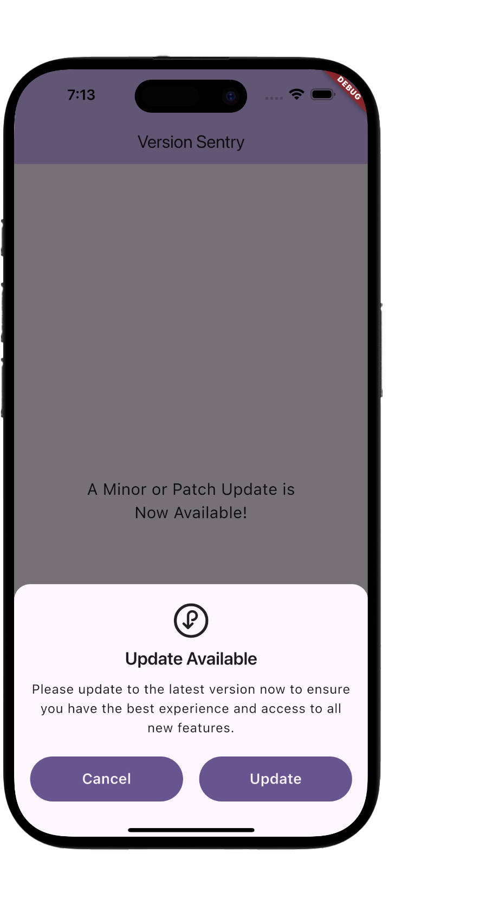
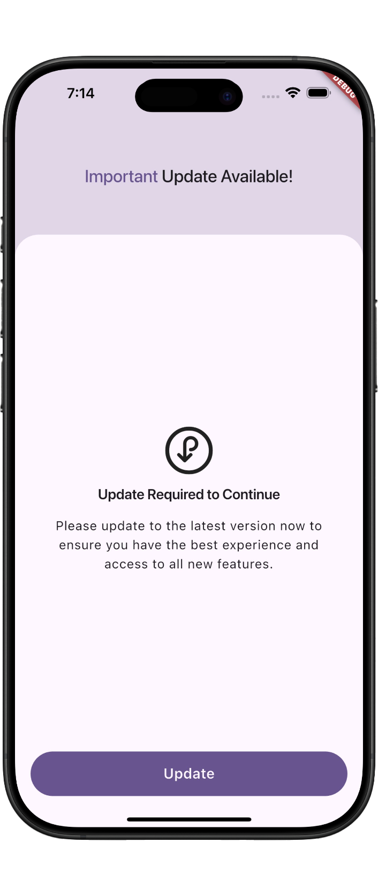

Version Sentry 
================
A Flutter package to help apps stay up-to-date by fetching the latest version from the Play Store (Android) or App Store (iOS).
Usage


## 📱 Screenshots

[//]: # ()
[//]: # (| Patch & Minor Update                          | Major Update                                  |)

[//]: # (|-----------------------------------------------|-----------------------------------------------|)

[//]: # (| ![patch_update]&#40;screenshots/patch_update.png&#41; | ![patch_update]&#40;screenshots/major_update.png&#41; |)

<!-- Titles -->
<div style="display: flex; justify-content: center; gap: 100px; font-weight: bold; font-size: 18px; margin-bottom: 10px;">
  <div>Patch & Minor Update</div>
  <div>Major Update</div>
</div>

<!-- Images -->
<div style="display: flex; justify-content: center; gap: 100px;">
  
  
</div>


-----
To use Version Sentry, simply call the versionSentryInfo function and pass the country code:

```dart
import 'package:version_sentry/version_sentry.dart';

void main() async {
  VersionSentryInfo? versionSentryInfo = await VersionSentry.versionSentryInfo(countryCode: 'in');

  print(versionSentryInfo?.currentVersion); // 1.0.0
  print(versionSentryInfo?.storeVersion); // 1.4.20
  print(versionSentryInfo?.needsUpdate); // true
  print(versionSentryInfo?.isMajorUpdate); // false
  print(versionSentryInfo?.isMinorUpdate); // true
  print(versionSentryInfo?.isPatchUpdate); // true
  print(versionSentryInfo?.releaseNotes); // Improve Design
  print(versionSentryInfo?.packageName); // com.example.example
  print(versionSentryInfo?.platform); // iOS
}
```

Features
--------
1. Fetches the latest version from the Play Store (Android) or App Store (iOS)
2. Provides information about the current version, store version, and update requirements
3. Supports country-specific version fetching using country codes

